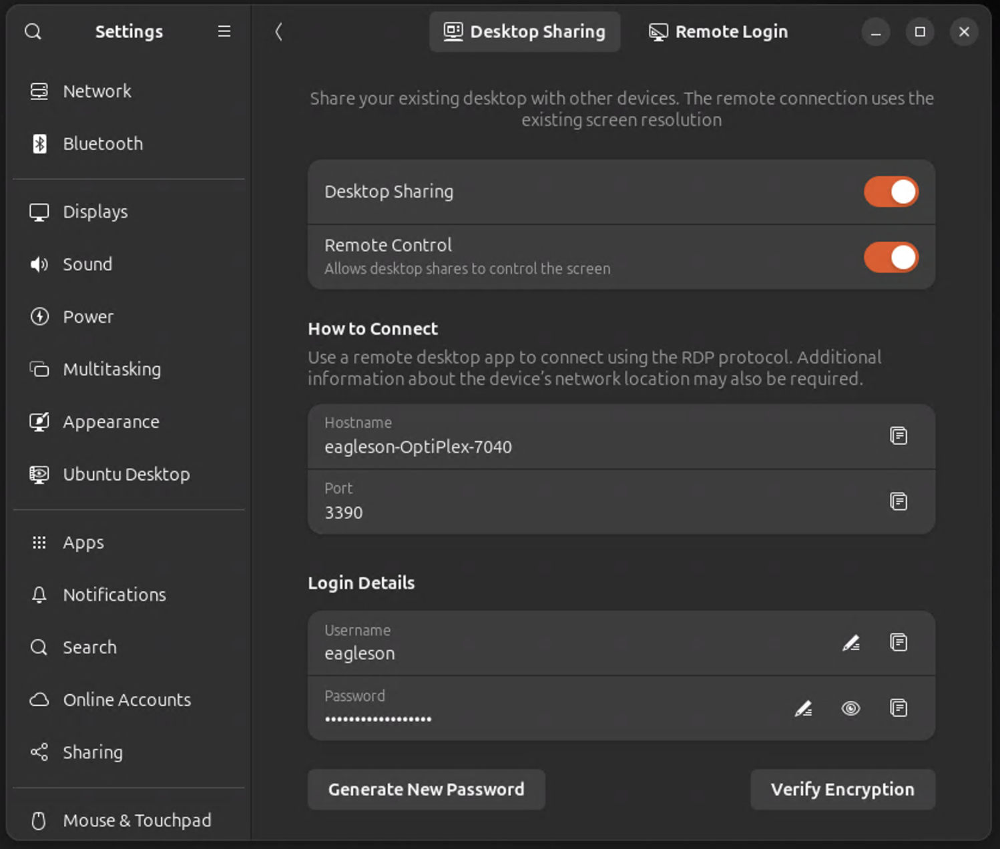

Settings -> Settings -> Desktop Sharing


use rdp

https://en.wikipedia.org/wiki/Remote_Desktop_Protocol




microsoft remote desktop

## ufw firwwall

sudo ufw allow from 10.8.0.0/24 to ant port 3389 proto tcp comment "Microsoft remote desktop"


also need to set up things on boot... maybe?

gnome extension manager


## Samba 

we'll use samba

https://en.wikipedia.org/wiki/Samba_(software)

```bash
sudo apt update
```

```bash
sudo apt install samba
```

gonna make a shared folder

```bash
cd ~/home-server
mkdir shared-folder
```

now open the configuration file:

```bash
sudo nano /etc/samba/smb.conf
```

ad add the following to the bottom:

```conf
[sambashare]
    comment = Samba on Ubuntu
    path = /home/{YOUR_USERNAME_HERE}/shared-folder
    read only = no
    browsable = yes
```


now set the samba password to your usernames password:

```bash
sudo smbpasswd -a {YOUR_USERNAME_HERE}
```

now restart for it to take effect:

```bash
sudo service smbd restart
```

if you have the ufw firewall enabled do this:

```bash
sudo ufw allow samba
```


you can check that its the safe version 3 with

```bash
sudo smbstatus
```

```
Samba version 4.19.5-Ubuntu
PID     Username     Group        Machine                                   Protocol Version  Encryption           Signing
----------------------------------------------------------------------------------------------------------------------------------------
2252839 eagleson     eagleson     10.0.0.188 (ipv4:10.0.0.188:62211)        SMB3_11           -                    partial(AES-128-GMAC)
```

above we see it's version 3.11 with `SMB3_11`

now on windows open file explorer and try:

```
\\YOUR_SAMBA_MACHINES_IP_ADDRESS
```

in my case that was

```
\\10.0.0.48
```

it'll prompt you to enter the username and the password you just created. when you do you should see a directrory called `sambashare` which maps to the `shared-folder` we created earlier.


how about android?

download fx file explorer from the play store

give permission to access files

enable the 7 day trial

select "network" then Windows Host (SMB) (even though its running on Linux, samba is a multi platform protocol)

enter IP address

choose an optional display name

leave share name blank

enter password every time, or if you are just playing around save unencrypted.  or use a system keyring.

SCREENSHOT

## use it on android!

install syncthing from fdroid


## use samba with wireguard

althoguh v2+ is encrypted, why not use the VPN?


in `/etc/samba/smb.conf`

```conf
# The specific set of interfaces / networks to bind to
# This can be either the interface name or an IP address/netmask;
# interface names are normally preferred
#;   interfaces = 127.0.0.0/8 eth0
;   interfaces = 10.8.0.0/24 wg0
```

then 

```bash
sudo service smbd restart
```


COnfigure the [sambashare] section in 

/etc/samba/smb.conf

then run

sudo service smbd restart


sudo ufw allow from 10.8.0.0/24  to any app Samba comment 'Sambashare over VPN'