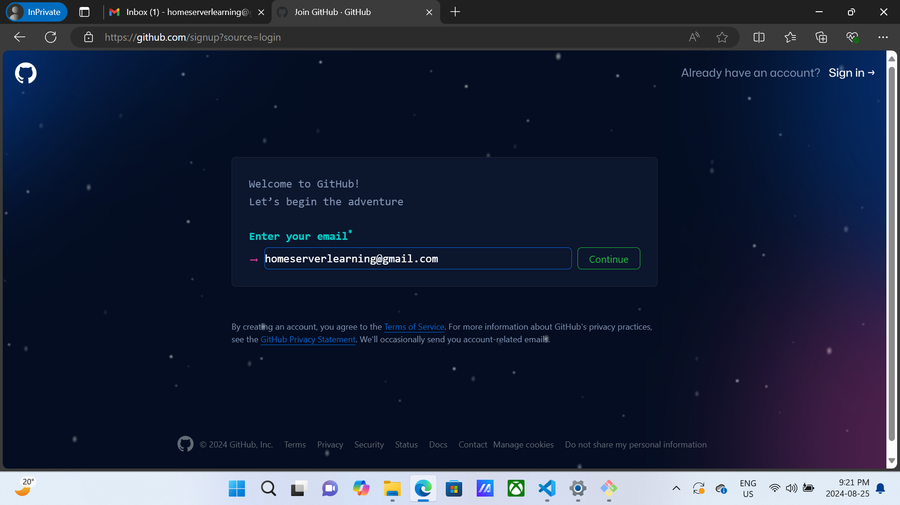
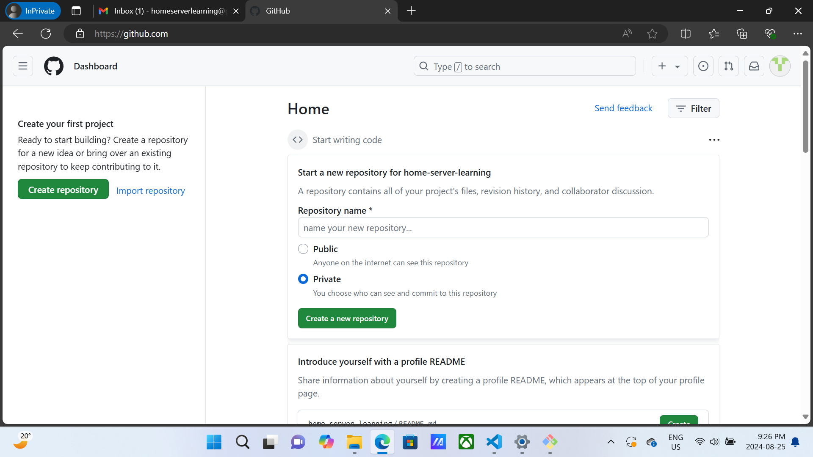
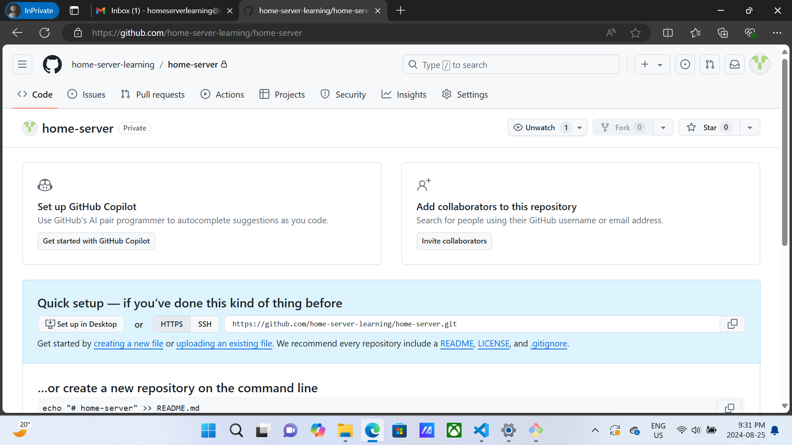
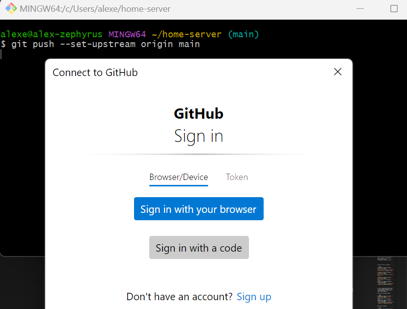
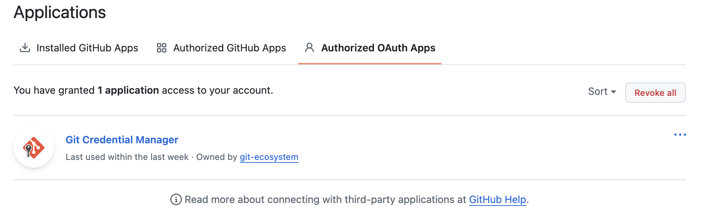

OPTIONAL

Next I recommend you create a Github account.  The purpose of this account is to store as much of your server configuration as possible remotely, so that if you ever lose everything on the machine it's as easy as possible to get a fresh one up and running again.

A secondary goal that I highly recommend (but ultimately up to you) is that this is where you also store the documentation and notes to your future self about how all this works.  Guarantee you're going to forget how it's all configured over time after you set it up, so you want it to be as easy as possible to come back and make modifications if anything goes wrong or you just want to make upgrades.  

Alright let's make the account.  They have a cool spaceship theme when you do.

https://github.com/signup

First create your username and password and once done, be sure to store them in your credential manager.



Once done you should see a dashboard:



So now we're going to create a new private repository.  There's absolutely no reason not to create a public one aside from just being able to fart around in private without others viewing.  

We can easily set it to public later, which I will be doing, but if you're comfortable enough and want to start as public from the get-go don't hesitate.

I'm going to create a private repository with the incredibly boring name of `home-server`.  



So this is a "repository".  Think of it like a copy of your folder in the [cloud](https://medium.com/@brian.greenberg/there-is-no-cloud-its-just-someone-else-s-computer-fe8b62a027a5).

Which folder?  Well we haven't made it yet.  We will soon.  One more step.

The most common question when learning is, what is the different between `Git` and `Github`?

So `Github` is a product owned by Microsoft that lets you host and interact with your files remotely on their service.  It's by far the most popular service for hosting git repositories, but it's definitely [not](https://bitbucket.org/product/) [the](https://beanstalkapp.com/) [only](https://sourcehut.org/) [one](https://gitlab.com/).

As for [Git](https://en.wikipedia.org/wiki/Git) itself, it is a free open-source tool (program) for file versioning.  In practice it's used the vast majority of the time for code and config files, but it can technically operate just fine on any kind of text files.

It's most powerful and useful features are its ability to show the the difference between two versions of files (e.g. before and after saved changes) and go back and forward in history between all saved versions of those files you've ever had.  

You use the git "program" on your machine to manage the files in your directory and then "Github" only handles the actual hosting of those files in the cloud.

First we need to make sure `git` is installed on your machine.  If you're using Mac or Linux then from the terminal type:

```bash
git --version
```

If you already have it installed and it's not way out of date, you're good to go.  

If you don't know where or how to do that, or you're on Windows and have never used it before, then it's likely not installed.  Go here:

https://git-scm.com/downloads

And install for your OS.  Just use the default settings suggestions.  If you're on Windows I highly recommend you install the optional "git bash" program.  That will give you a terminal that lets you use Linux style terminal commands on Windows, and that way I can just use examples of [bash](https://en.wikipedia.org/wiki/Bash_(Unix_shell)) commands and you can follow along regardless of what OS you are on.

Once you're done you should be able to open your terminal (use git bash unless you already know you prefer another) and run this command:

```bash
git --version
```

And see this output (your version may be different than mine, that's fine)

```
git version 2.39.5 
```

If it says anything like "git not found" or not recognized then it means you didn't install it properly.  Visit the [git website](https://git-scm.com/downloads) again and make sure to follow the instructions.  


## Making Your `home-server` Project

Let's go create the directory that will be making a copy of later.

I'm gonna make a folder called `home-server` in my home directory of `c/Users/alexe` (this is Windows by the way) but the same idea would apply if you're using a mac or another Linux machine.  Pick anyone on your machine that you'll remember to navigate to later.

Here's a quick [cheat sheet for terminal commands](https://cheatography.com/davechild/cheat-sheets/linux-command-line) if you need it.

If by chance you've ignored my suggestion to use the bash terminal and want to use Windows Powershell you totally can.  In fact here's a [Powershell cheat sheet](https://ramblingcookiemonster.github.io/images/Cheat-Sheets/powershell-basic-cheat-sheet2.pdf).  But all my examples will be in bash syntax, so you're on your own to translate them yourself if you do.

```bash
mkdir home-server

cd home-server
```

That will create a directory called `home-server` and then change your current directory to that one.

By the way, two of the most critical tips for using the command line on any OS:

- Live and die by the tab key.  It autocompletes any command it recognizes.  Never type stuff yourself manually that you don't have to.
- Press `up` and `down` to navigate between previous commands and enter/return to run them again

That should speed you up by 1000% if you didn't know those already.

Alright let's focus on `git`.  

From your `home-server` directory run the following command:

```bash
git --status
```

And you should get the following output:

``` 
fatal: not a git repository (or any of the parent directories): .git
```

That's telling you that you haven't actually "initialized" this directory as a git repository, so it can't begin tracking any of the files (you know, the ones that don't exist yet).  

Anyway, to initialize it:

```
git init
```

After that you can try to check the status again and should see something closer to this:

```bash
alexe@alex-zephyrus MINGW64 ~/home-server (main)
$ git status
On branch main

No commits yet

nothing to commit (create/copy files and use "git add" to track)
```

That says git is initialized, but you don't have any files yet.  

Let's make a file:

```bash
touch README.md
```

`touch` is the command to make an empty file.  `.md` is the [markdown format](https://en.wikipedia.org/wiki/Markdown), very similar to a `.txt` file but allows you to wrap text in different characters to help describe how it looks (like headers, tables, links, etc).  

Similar to [HTML](https://en.wikipedia.org/wiki/HTML) if you're familiar with that.  This guide is written in markdown format, and if you're reading it on Github, that service is deciding how to render it based on the [markdown standards](https://www.markdownguide.org/).

Alright, let's add some text to that `.md` file.  You can open it in a text editor and do it manually, or run this command to write some text:

```
echo "hello!" >> README.md
echo "# big hello!" >> README.md
```

`echo` is the terminal command to basically repeat back what you just said.  The `>>` syntax means "redirect the output to X" in and this case X is your `README.md` file.  

If you ever want to know more about what a command does use the `man` command followed by the name of the command.  `man` stands for `manual`.  E.g. `man echo` will tell you more about `echo`.  

Next you can see the contents of that file again by either opening it in a text editor, or using the `cat` command (which stands for "concatenate"):

```bash
cat README.md
```

It should print out

```
alexe@alex-zephyrus MINGW64 ~/home-server (main)
$ cat README.md

hello!
# big hello!
```

Alright so now you have a file with some text in it.  Let's make a "commit" which is basically like a "snapshot" in time of the current saved state of all files in this directory.  We'll be able to navigate between commits (snapshots) any time we like, so even if a file is saved over, no work is ever lost as it exists in the history.

Before we commit, we have to stage (add) the files we've changed.  Normally you typically want to just add "everything" unless you have reason not to.  You can do that with the command `git add .` where `.` represents "add files in this directory" but you can also add files one at a time:

```bash
git add README.md
```

Regardless of which one you used, you can run this command:

```bash
git status
```

To see the status of all your files including the one you just added:

```
alexe@alex-zephyrus MINGW64 ~/home-server (main)
$ git status

On branch main

No commits yet

Changes to be committed:
  (use "git rm --cached <file>..." to unstage)
        new file:   README.md
```

As you can see there it has the changes to `README.md` as ready to be committed.  SO let's commit them:

```bash
git commit -m 'initialize readme'
```
The `-m` is the message.  What follows in quotes is meant to be a description of what you changed so that your future self (and others) can read it for some extra context.

Of course, unless you've already used git on this machine that command is going to fail:

```
alexe@alex-zephyrus MINGW64 ~/home-server (main)
$ git commit -m 'initialize readme'
Author identity unknown

*** Please tell me who you are.

Run

  git config --global user.email "you@example.com"
  git config --global user.name "Your Name"

to set your account's default identity.
Omit --global to set the identity only in this repository.

fatal: unable to auto-detect email address (got 'alexe@alex-zephyrus.(none)')
```

We need to configure our details that will be associated with our commits so that they can be identified.  Every commit when using git requires a name and email.  

They do not need to be real.  Git will not ask you to verify you even own the email address.  But to avoid confusing we should use our own.

If you'd actually like to "sign" your commits, or in other words, make it so they have some identifier to help prove it was you who made them and nto someone else you can look into creating [GPG Signing Keys](https://docs.github.com/en/authentication/managing-commit-signature-verification/signing-commits).  This tutorial won't go through that full step, but if you are interest that link should tell you everything you need to know.

Alright let's set our details:

```bash
alexe@alex-zephyrus MINGW64 ~/home-server (main)
$ git config --global user.email "homeserverlearning@gmail.com"

alexe@alex-zephyrus MINGW64 ~/home-server (main)
$ git config --global user.name "Alex E"
```

After that try committing again and you will have a better time:

```bash
alexe@alex-zephyrus MINGW64 ~/home-server (main)
$ git commit -m 'initialize readme'

[main (root-commit) 8181572] initialize readme
 1 file changed, 2 insertions(+)
 create mode 100644 README.md
```

Great!  Just before we push to Github, let's take a quick moment to check out how git diffing works.  In git a `diff` is just a way of visualizing the difference between two text files.  

Open up your `README.md` in a text editor and change "hello" to "goodbye" and save it.  

Now run this command:

```bash
git diff
```

That will show the difference by default between your current uncommitted changes and the last commit.

```diff
index ce01362..dd7e1c6 100644
--- a/README.md
+++ b/README.md
@@ -1 +1 @@
-hello
+goodbye
```

Notice that coloured syntax and `+/-` showing the removal of "hello" and the addition of "goodbye"?  Very handy for visualizing changes.  You can also look at the diff between commits, not just unstaged active work.  Github also gives you a nice UI for visualizing diffs.  

Ok the last step is to push your work to your Github repository.

Right now you have a repository called `home-server` and a folder on your machine called `home-server`... but there is no actual "connection" between them.  They don't know anything about one another.  Aside from having the same name, they have little in common.

We need to tell our local git program the URL of our remote repository, and give that repository a name.  The reason it needs a name is that technically can push a copy of your local git repository directory to as many remote services as you want.  

In practice the vast majority of people only keep a single remote copy of a repository, and the convention (unless you have a good reason to do otherwise) is to name that remote repository `origin`.  In fact that's git's default I think.

So here's the command:

```bash
git remote add origin YOUR_REPOSITORY_URL
```

In my case the URL is `https://github.com/home-server-learning/home-server.git` but you'd enter yours replacing `YOUR_REPOSITORY_URL` in the command above.

You can double check that it set the URL correctly with:

```bash
git remote get-url origin
```

For me it prints back:

```
https://github.com/home-server-learning/home-server.git
```

For you it should be different.  

add the origin.  this basically sets a remote equivalent direcotry to sync to

```bash
git remote add origin https://github.com/home-server-learning/home-server.git
```

Now when you're ready to push, run this command (in this command `main` is the name of our [branch](https://www.atlassian.com/git/tutorials/using-branches) and should be the default):


```bash
git push --set-upstream origin main
```

Once again, if you haven't configured git and Github on this machine, it's going to fail.  



This says that you aren't allowed to push to that remote repository, which makes sense... I mean with that URL anyone could push to it right?  

You need to authenticate your local git with your remote Github's credentials.

You should see an auth popup appear.  Select "sign in with browser"

That will create token which you can see in your Github profile if you navigate to "Authorized OAuth apps"

https://github.com/settings/applications




You can also actually see how the credential gets filled with this command, substituting your git URL:

```bash
$ echo url=YOUR_REPOSITORY_URL | git credential fill
```

And you'll see an output like this, with your credentials (don't share them!):

```
protocol=https
host=github.com
username=home-server-learning
password=abcdefghifklmnopqrstuvqxyz
```

Pretty cool.


