This is where it begins

First, buy this:

https://www.amazon.ca/Dell-Latitude-Business-Certified-Refurbished/dp/B07K6YG7YY

If that link is broken, it's a:

```
Dell Optiplex 7040 Business SFF Computer Small Tower PC (Intel Core i5-6500, 16GB Ram, 256GB SSD, DVD-RW, WiFi) Win 10 Pro (Renewed)
```

If you can't get exactly that, get something similar.  Exact specs don't matter.

### Optional Extras:

I picked up an extra SSD and some RAM to beef up the machine.  It is absolutely not necessary at all, what it comes with is more than enough to follow all these steps.  

But since I'll be including examples of installing them, these are the items as a reference:

* [Crucial T500 2TB Gen4 NVMe M.2 Internal](https://www.amazon.ca/Crucial-Internal-Gaming-Desktop-Compatible/dp/B0CK2TC9XQ)

* [Corsair Vengeance LPX 16GB (2x8GB) DDR4 DRAM 3200MHz C16 Desktop Memory Kit](https://www.amazon.ca/Corsair-Vengeance-3200MHz-Desktop-Memory/dp/B0143UM4TC)

# Setup

Here's what the machine looks like on arrival.  Comes with a keyboard and mouse too.

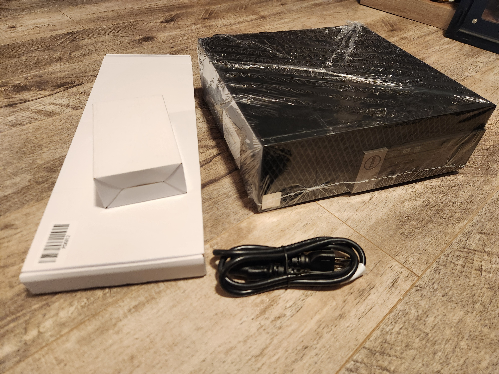

## Boot Windows 10

It includes a 250GB SSD with Windows 10 already loaded, so first step will be to just verify that boots and works.

Plug it all in and boot it up, should be straightforward.


Once you've confirmed that works, power it down and unplug everything.

## [Optional] Add Extra Components

If you have any additional hardware to add, we'll do that next.  If not, you can skip this step (or just read along and look at the pictures to get an idea what it looks like inside in case you want to upgrade it later)

The nice thing about these Optiple maachines is they are etremely easy to upgrade.  You don't even need a screndriver, pretty much everything is just blue clips that you slide open.

(One exception is that you need a tiny screwdriver if you're going to install an M.2 hard drive)

Pull the blue slider on the back and open it up.


You can see the 256GB SSD it comes with at the upper left there that says "Panther series".  That's where Windows 10 is installed.

Next I've unplugged and removed the hard drive and lifted that whole section by moving another blue slider clip:

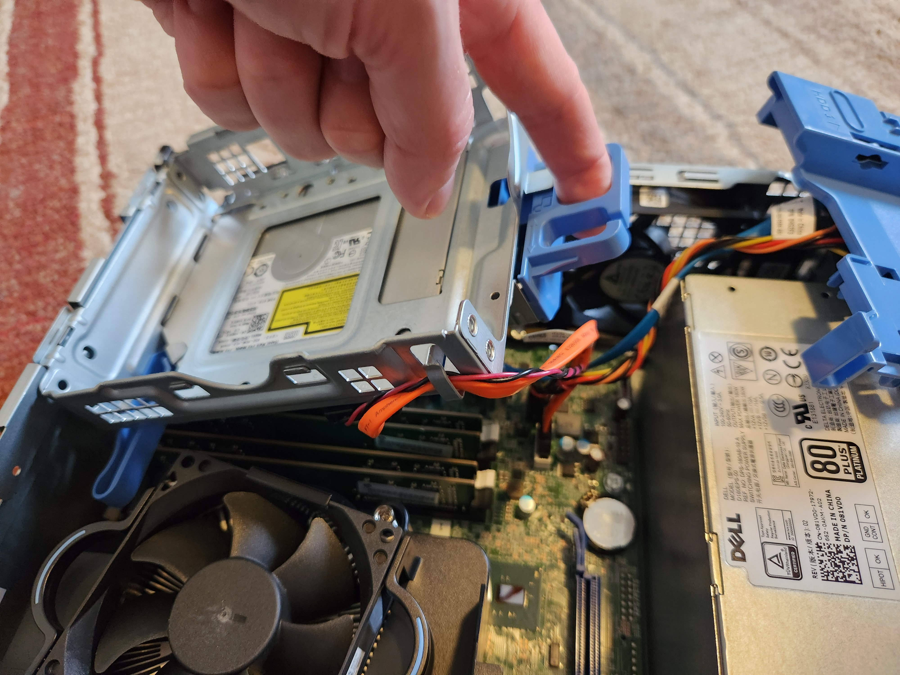

This is after taking out the hard drive section.  Underneath is the RAM and the M.2 slot.  The RAM are the four sticks you see in a line at the bottom of this photo:


If you're upgrading the RAM you can remove them.  I take out the four 4GB sticks it came with (16GB) total and replace with four 8GB sticks (32GB total).  

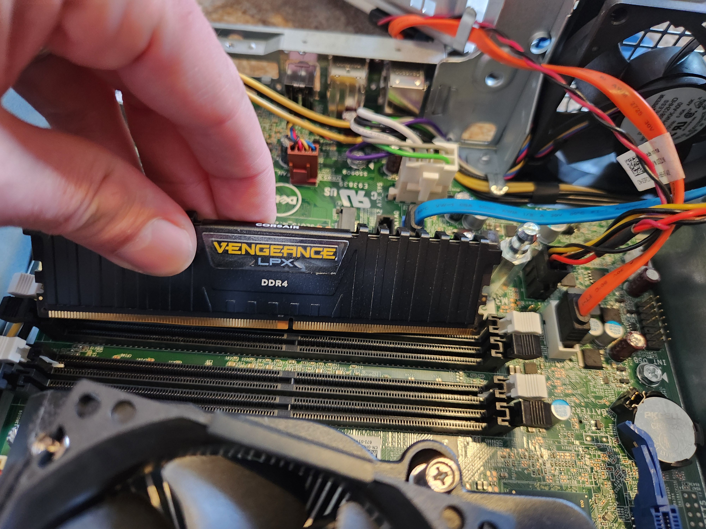

If you are only installing two sticks make sure you install them in the correct slots, [here's a forum post that tells you which to use](https://www.dell.com/community/en/conversations/optiplex-desktops/dell-optiplex-7010-ram-slots/647f95a7f4ccf8a8de836561?commentId=647f95bdf4ccf8a8de858d27).

Technically say you only have two sticks and two of the slots are still empty, you could put two of the 4GB sticks back in, but there is some complexity around mismatches with both RAM capacity and speed as well as voltage and even brand.  

I'm not going to go into it too much, but if you want to you can learn more here on how to approach it and decide if it's something you want to pursue:

https://www.technewstoday.com/can-you-mix-ram/

Alright, next is the M.2 drive.  You'll need a very tiny screwdriver for this one.  The drive itself might even come with one.  

Put it in at an angle like the image below, then lay it down and use the screw to hold it in place.  Don't screw it too tight, just gently firm.  

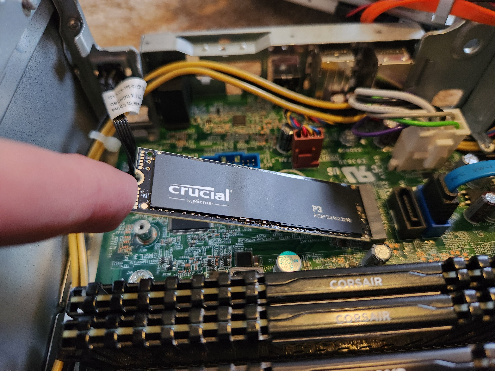

Time to close it back up.  

Oh wait, I forgot I had another hard drive lying around from another laptop that died.  A 500GB SSD.  Alright I'm gonna stick that in too why not.

I actually had to get a SATA power splitter cable to do this, because there aren't enough available on the power supply in the machine.  Here's the exact one I bought:

* [Modeshell (2-Pack) SATA Splitter Power Cable 15 Pin Male to Dual Female Power Y Cable Dual Splitter SSD Hard Disk Drive Extension Cables](https://www.amazon.ca/Modeshell-2-Pack-Splitter-Female-Extension/dp/B07PRSWY5L)

Looks like this (the coloured one at the top of the photo)


And here's how I set it up.  I used the split power to connect both the SSD that came with the machine (the panther) and the extra one I had (the Samsung).  

I used a high tech zip tie to hold them in place because that's what I had lying around.  IN the photos below one drive is attached to the top of the hard drive section, and the other drive is tied to the underside of it.

Both drives connect to the motherboard for data with separate SATA cables.  You can see where I've connected them to the motherboard in the last of the below three photos.  

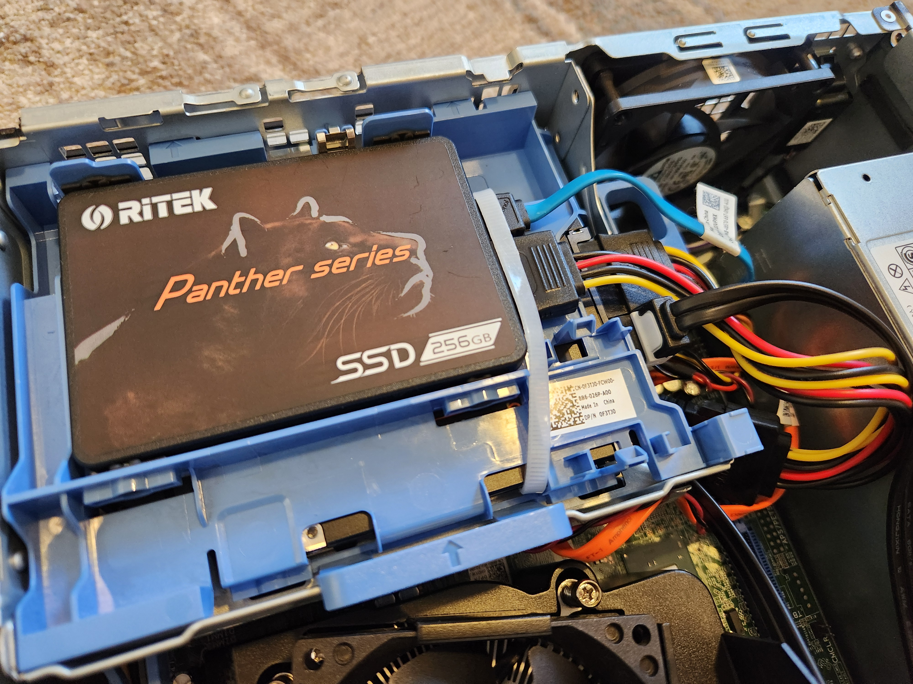

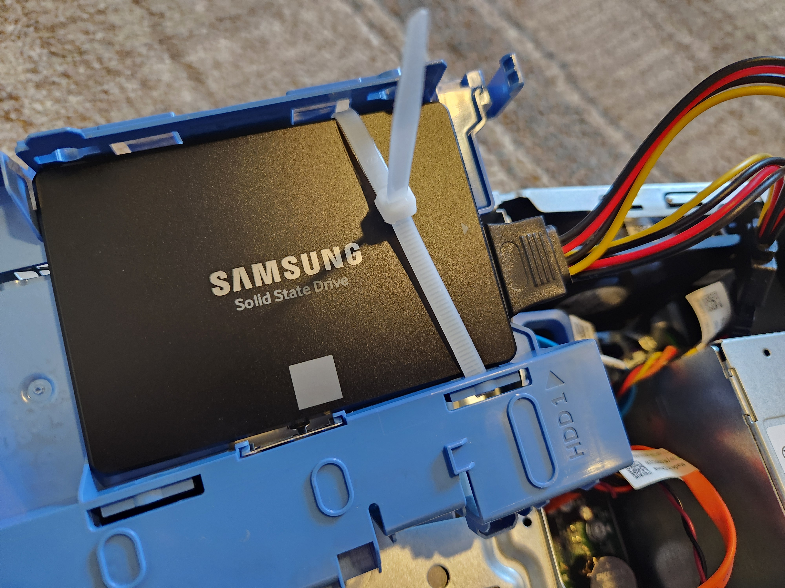

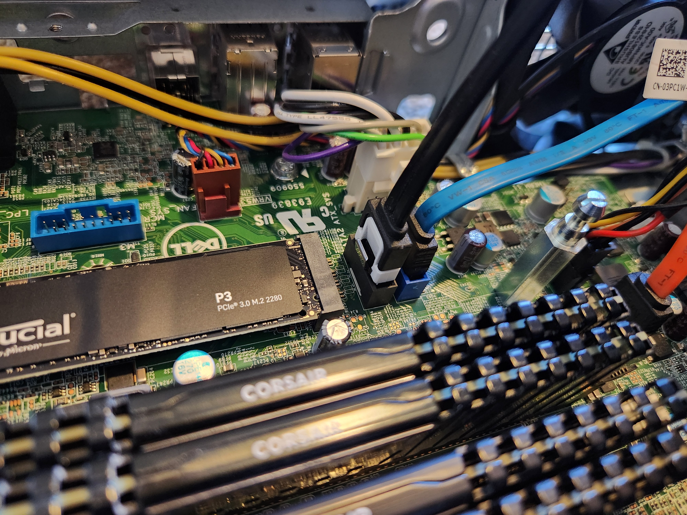

Alright, put it all back together and plug it all in and turn it on.

If you're lucky you'll see a screen that looks like this:

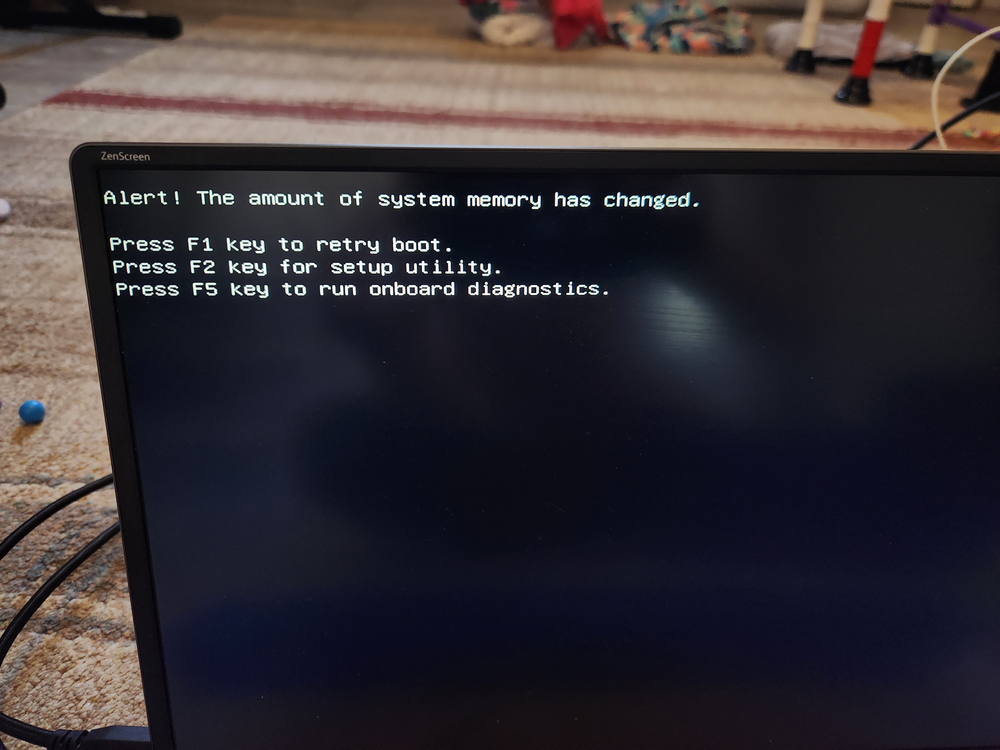

Nice.  Let's go into the machines BIOS to check that all our hardware is recognized and installed correctly.

## BIOS Menu

Regardless of whether you added additional hardware to your machine or not, it's worth familiarizing yourself with the BIOS menu and how to get to it.

If you don't know what BIOS then [Wikipedia will tell you everything you need to know and more](https://en.wikipedia.org/wiki/BIOS) or if that's too dense you can just look up [something more user friendly](https://www.lifewire.com/bios-basic-input-output-system-2625820).


Here's [Dell's instructions on how to access the BIOS on the Optiplex](https://www.dell.com/support/kbdoc/en-us/000126121/access-uefi-bios-system-setup-from-windows-on-your-dell-system?msockid=1fd21756e0f86b093e7f02eee1526af8).  

In case that link is dead or has too many ads and popups to make use of, the relevant part is:

```
How to access the UEFI or BIOS without booting into Microsoft Windows

Turn on the computer.

At the Dell logo, tap the F2 key several times.
```

So basically just slam the F2 key while the machine boots and you should get there.  

Start by looking for "System Information".  If you added new hardware you should see it here.

In the below photograph of a computer screen we can see the new 32GB RAM I installed is recognized correctly (as 32,000MB).  You also want to check the _speed_ of the RAM and make sure that it matches what the package says.  

It's possible your motherboard might not recognize the speed that the RAM supports, but you should be able to manually override and set it to the correct speed, which is the speed on the RAM's package up to but not exceeding what the motherboard can handle.

[You can see a list of supported RAM speeds for Dell's lineup here](https://www.dell.com/support/kbdoc/en-us/000132428/dell-optiplex-memory-compatibility-guide)

The max values for the Optiplex 7040 (Small form factor) that I'm working with here are:

```
OptiPlex 7040 (SFF, MT)	4 Slots	64 Gb	2133 MHz (DDR4)
```

And you can see in the image the speed of the RAM matches that max value.  

You can also see the M.2 drive recognized toward the bottom.


---

<details open>

<summary>[Optional] BIOS Power Settings</summary>

You can use the BIOS to configure how your machine will react during power loss.  This is particularly helpful given that the intention is for your services to be available, if not 100% of the time -- then at least 100% of the time your home has power.

Maybe you'll take this further than a BIOS setting and really protect your home server with a [UPS like this one](https://www.cyberpowersystems.com/product/ups/intelligent-lcd/cp1500avrlcd/) as well as some [reasons why you might want one](https://www.nytimes.com/wirecutter/reviews/best-uninterruptible-power-supply-ups/) -- but until you're ready to make that investment this setting acts as a pretty decent low cost alternative.

It doesn't protect against power loss and surges, it's entirely a convenience thing.

Navigate to the "Power Management" section of the BIOS.

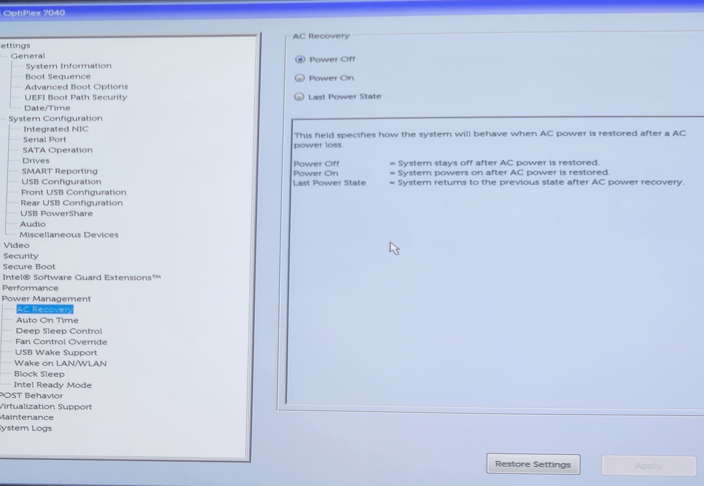

If you set the value to "Last power state" then it will automatically turn back on when the power returns (if it was on) or stay off if it was already off.

Combine that with having your services automatically run on boot and your network should all come back up and be fully available after a power loss with no action on your end.

</details>

---

Alright, boot back into Windows 10 again and double check that your OS (Windows) also recognizes your hardware as you expect.  

In the below images we see the RAM is recognized and all three hard drives are recognized.


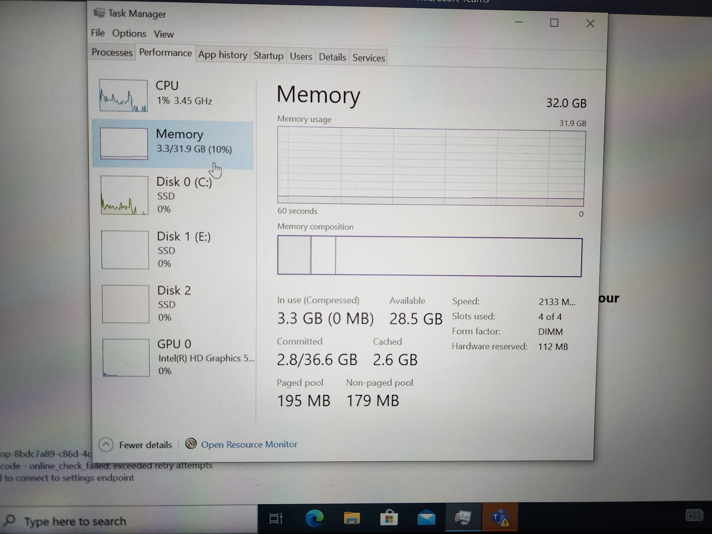

Alright, we're good to start installing linux.

## Installing Ubuntu (Linux)

### Why Ubuntu?  Why Linux?

We're going to be installing Ubuntu Linux on the machine.

Why Ubuntu?  Because it's extremely popular, well supported, and looks very familiar interface-wise to users coming from Windows.  If for any reason you have another flavour of Linux you prefer, don't hesitate to use that instead.  This guide will assume Ubuntu though just to keep things simple.

Another separate questions is "why Linux at all?" as opposed to Windows or Mac.

The answer honestly is just because so many of the server and "service" based software of the world is designed first and foremost to run on Linux.  Linux powers most of the servers in the world.  

I'm pretty sure you could run most if not all the services that I plan to set up on Windows and Mac, and again if that's what you prefer, go for it.  This tutorial will presume you're using Ubuntu though.

### Preparation

The high level overview of what you'll be doing in this section is:

1. Download Ubuntu Linux
1. Out it on a USB stick and configure it to be bootable
1. Reboot the machine with the stick plugged in so that it boots to the installer
1. Install Ubuntu

### Create the bootable USB

Rather than me writing out all of these steps, you're best to just follow an official source.  THis is the guide I followed and it was extremely easy:

(This is presuming you'll be downloading and setting up the stick on the copy of Windows 10 that came pre-loaded with your computer).  

If you're using something other than Windows to do this (like Mac) it's absolutely possible you may just have to Google a different tutorial.

https://ubuntu.com/tutorials/create-a-usb-stick-on-windows#1-overview

Once you have a bootable USB stick ready you can continue to the next step below.

### Use the bootable USB to install Ubuntu (Linux)

WHen you boot the machine with that USB stick plugged in you should land on a menu that asks you to select a boot device.  Choose the USB stick.

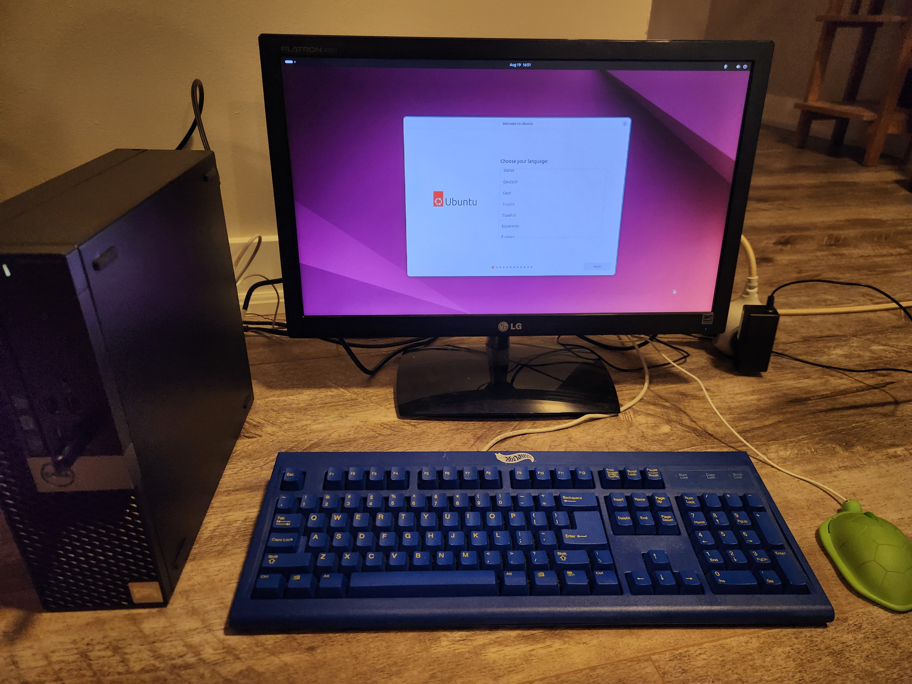


If by chance you don't land on a menu, it's like one of the following two things:

* You didn't create the bootable USB properly. Try revisiting the tutorial.

* Your BIOS are setup to ignore it or default to something else. Go back to the BIOS and look for boot options and choose one that prioritizes booting from USB.

If all goes well you should be prompted to install Ubuntu.  Make sure that when you select the drive you select the one you actually want to use.

---

<details open>

<summary>[Optional] Install to Separate Hard Drive</summary>

### 

If you did upgrade to add a second hard drive or SSD in the machine, you can choose to install Ubuntu on that drive instead.  Make sure you select the correct one, hopefully your drives should be named in a way you can identify them  

If not you can always boot back to Windows and check and/or rename them.

Installing on a separate drive will allow you the possibility of booting Windows 10 on a virtual machine from inside Ubuntu, something that is not possible if they are both installed on the same physical drive

(Well maybe it's _possible_ but it's a lot more complicated.)

Up to you if that's something you're interested in.  If not, don't hesitate to install Ubuntu on the same drive as Windows.  

</details>

---

It may ask you to create a partition if you're installing Ubuntu to the same drive as Winodws.  If so, use your discretion to decide how much of the drive you want to allocate for Ubuntu and how much for Windows.

If you're planning on running your services 24/7 then you it makes sense to allocate pretty much all drive space to Ubuntu.  

You will also need to create a user and password to sign into Ubuntu.  I recommend something easy to remember and type.  

[A passphrase is always a great and secure choice](https://www.useapassphrase.com/).  I encourage you to read that page if you are unsure why it would be more secure than something shorter with lots of numbers and symbols.

We'll discuss storing your credentials further along in this tutorial after the OS is all set up, but for now just make sure to create a good password and username and keep track of them somewhere safe.


Once you've completed that final step then you're pretty much ready to start setting up your OS and installing some services.

Take some time to familiarize yourself with Ubuntu and play around.

Before you move on, it would be a good idea to check for software updates (you just installed it, so there shouldn't be very many).

Most software on Linux is managed by package managers, in Ubuntu's case it uses [APT](https://en.wikipedia.org/wiki/APT_(software)).

So open a terminal and run the following two commands one after the other:

```bash
apt update

apt upgrade
```

You'll likely encounter your first permission issue.  Linux is heavily designed around its permissions system.  If you're new to this, it'll be your first introduction to the [sudo command](https://en.wikipedia.org/wiki/Sudo).

`sudo` is basically a convenience command that lets you run stuff with admin (root) permissions without actually being signed into the root user, as long as your current user is listed in the list of users with permission to do this (if this is the user you created when you installed Ubuntu then it should be by default).

You can check which user you are with the `whoami` command:

```bash
whoami
```

I get:

```
eagleson
```

You'll get whatever username you created.  

How do you know if this user can do sudo commands?  See if you're a member of the `adm` group.  YOu can list all groups with:

```bash
compgen -g
```

You'll likely see a lot of groups, most of which you don't need to think about.  List the users of the admin `adm` group with:

```bash
getent group admin
```

The output for me is:

```
adm:x:4:syslog,eagleson
```

There you can see I'm a member of the admin group.  So I can use the sudo command!  Let's try the software update again:

```bash
sudo apt update

sudo apt upgrade
```

It will likely prompt you to enter your password the first time you run the command, and once you do you'll be giving permission to use `sudo` for a limited amount of time.  Don't recall what the default is, maybe an hour or so.  You can [configure it if you want](https://www.omglinux.com/change-sudo-timeout-linux/).

Those two commands should handle automatically updating all the software for you.

The final step before you do anything else, separate from anything on this machine itself, will be to set up some kind of secure and encrypted credential store (e.g. a password manager).  

Once you have that don't forget to store the Ubuntu login username and password you created here in it. 