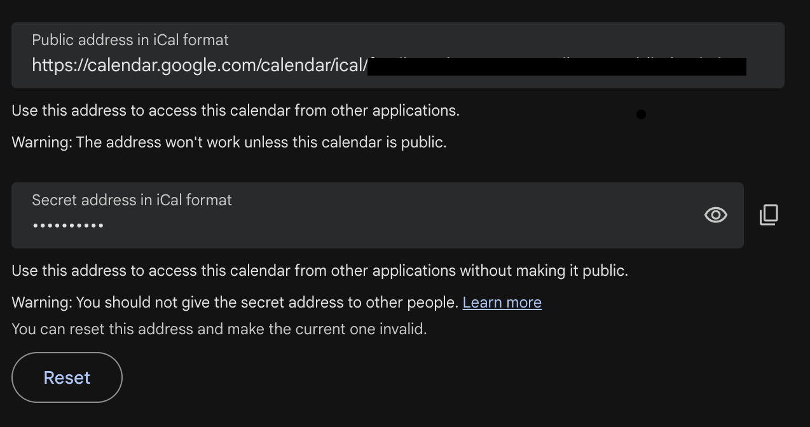
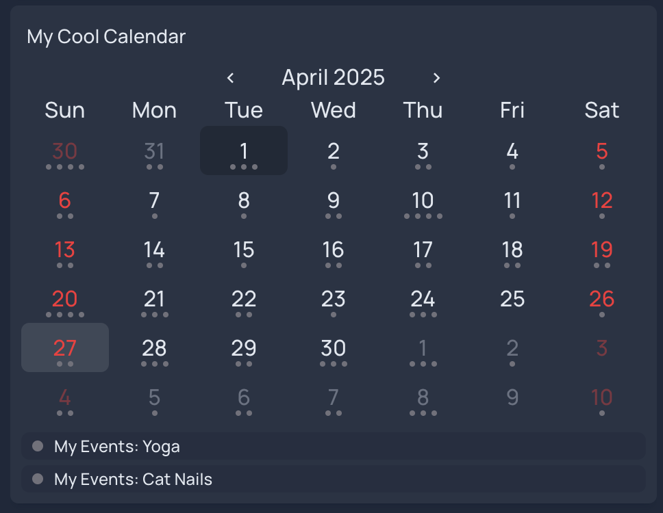

## Initial Configuration

edit services in config/services.yml

make sure 10.8.0.3:3000 is in the list of allowed host (this optiplex VPN IP) port is important and required

just using the APP_NAME.png icon pulls from here https://github.com/homarr-labs/dashboard-icons/tree/main/png


## Adding a Google Calendar Widget

Relevant documentation link:

https://gethomepage.dev/widgets/services/calendar/

You can add an empty calendar to `config/services.yml` with the following format:

```yml
- Calendar:
    - My Cool Calendar:
        widget:
            type: calendar

```

You can then integrate that with an existing calendar.  There are many supported calendar integration formats.  I personally use Google Calendar, which can be integrated in [iCal format](https://en.wikipedia.org/wiki/ICalendar).

To integrate a Google calendar:

1. Sign into your Google account and open Google calendar.
1. Select the settings gear icon at the top
1. Look for "Settings for my Calendars" at the lower left in the settings menu, and select the one you want
1. Choose "Integrate calendar" and it should scroll you down to a section that looks like the screenshot below
1. If your calendar is public, copy the "public URL" and if it's private copy the "secret address".  It goes without saying you shouldn't share the secret address with anyone else, otherwise they'll be able to view your private calendar anytime they like.  (If the URL is ever shared accidentally, just click the `Reset` button to invalidate the URL and generate a new one).
1. Modify `config/services.yml` calendar widget per the example below, make sure to replace `YOUR_SECRET_URL_HERE` with your calendar's actual URL.  You can modify some of the params like `view` and `name` etc to your liking. Use the docs to see what options are available.



```yml
- Calendar:
    - My Cool Calendar:
        widget:
            type: calendar
            firstDayInWeek: sunday
            view: monthly
            integrations:
            - type: ical
              url: YOUR_SECRET_URL_HERE
              name: My Events
              color: zinc 
              params:
                showName: true 
```

When you're done, it'll look something like this:




TODO: remember to create an example `services.yml` without my private info in it


Style settings:

https://gethomepage.dev/configs/settings/


todo i stole theming from this thread:

https://github.com/gethomepage/homepage/discussions/473