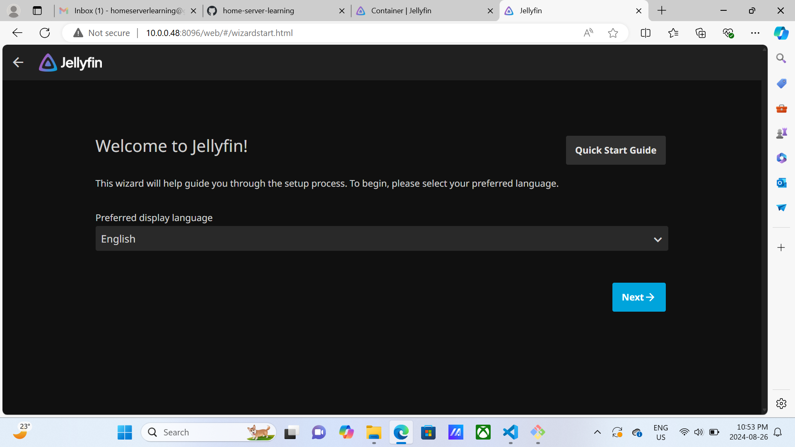

jellyfin docs

https://jellyfin.org/docs/general/installation/container/

image docs github:

https://github.com/linuxserver/docker-jellyfin

simplest compose:

See `docker-compose.example.yml`


```bash
sudo docker compose up
```

try running without -d to see errors

when satisfied ctrl + C and then:


```bash
sudo docker compose up -d
```

now you are ready to instal;



install everything.  leave "allow remote access" unchecked as we will deal wit hthat later


create a password and add your kaiju folder 
add your kaiju folder


## UFW in LAN

 sudo ufw allow from 10.0.0.48 to any port 8096
