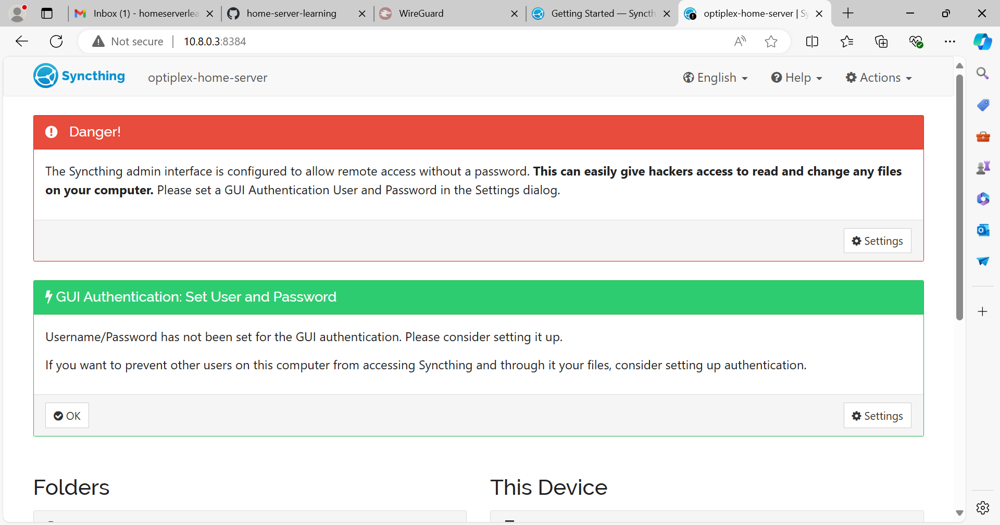

source:

https://dev.to/suin/how-to-easily-run-syncthing-with-docker-compose-24ci

create a folder called `syncthing` and then inside and start the compose file

environment:

PUID=1000 and PGID=1000
These set the user and group IDs for the container.
This ensures that files created within the container match your host user's permissions.
Replace these values with your actual UID and GID, which you can find by running id -u and id -g on your host machine.

when done you should be able to access it with that machine's IP from anywhere on your network

if you are planning on forwarding the admin port on your router then it's absolutely critical you setup a username and password.  if you are only accessing it via the wireguard VPN it's not as important.  

adding a client

Click "Add Remote Device" on the itnerface.  

if you are already on the same local network then you should probabaly see the device ID right there.  you can compare it against the client you are looking at  by doing "menu -> show device ID" on the android app for example

to to the web UI with

{YOUR_IP}:8384
